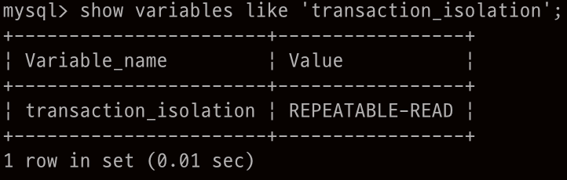

## Isolation Default Value in MySQL

Repeatable Read는 commit 되지 않은 신뢰할 수 없는 데이터를 읽어 올 수 없고 한 트랜잭션에서 동일한 select 쿼리의 결과가 동일하다는 것을 보장한다.

다만 이전의 select 쿼리의 결과에 없던 row가 생기는 **phantom read**의 문제가 생긴다. 진짜 그럴까?

MySQL에서는 phantom read 또한 발생하지 않는다.

MySQL에서는 Read Committed와 Repeatable read level에 대해서 한 트랜잭션에서 select 쿼리로 데이터를 읽어올 때 테이블에 lock을 걸지 않고, 해당 시점의 데이터 상태를 의미하는 **sanpshot**을 구축하여 거기서 데이터를 읽어온다.

Read Committed에서 각각의 select 쿼리는 그때그때 최신의 snapshot을 구축하여 데이터를 읽오온다. 따라서 한 트랜잭션이지만 select 쿼리의 결과가 다르기도 했다.

반면 Repeatable Read는 한 트랜잭션에서 처음 데이터를 읽어올 때 구축한 snapshot에서 모두 데이터를 읽어온다. 따라서 매번 select 쿼리의 결과들이 항상 처음과 동일했던 것이고 이로 인해 phantom read도 발생하지 않는 것이다.

또 한가지 흥미로운 점은, 비록 한 트랜잭션에서 select 쿼리는 항상 동일하더라도 다른 트랜잭션에서 건드린 row에 대한 update, delete의 결과는 출력될 수 있다.
